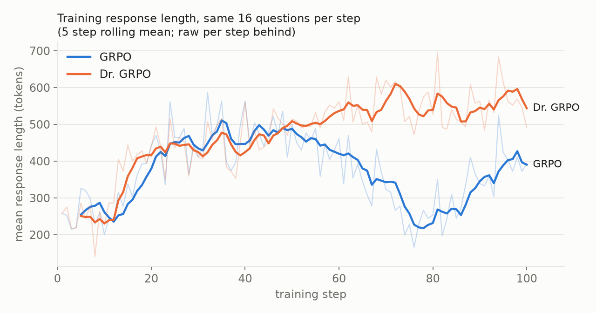
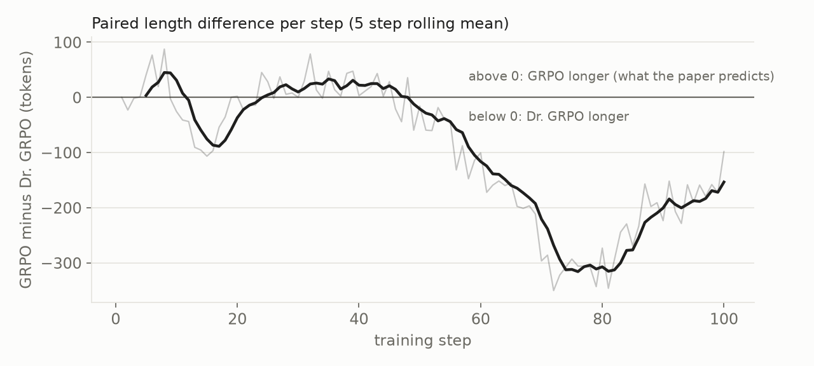
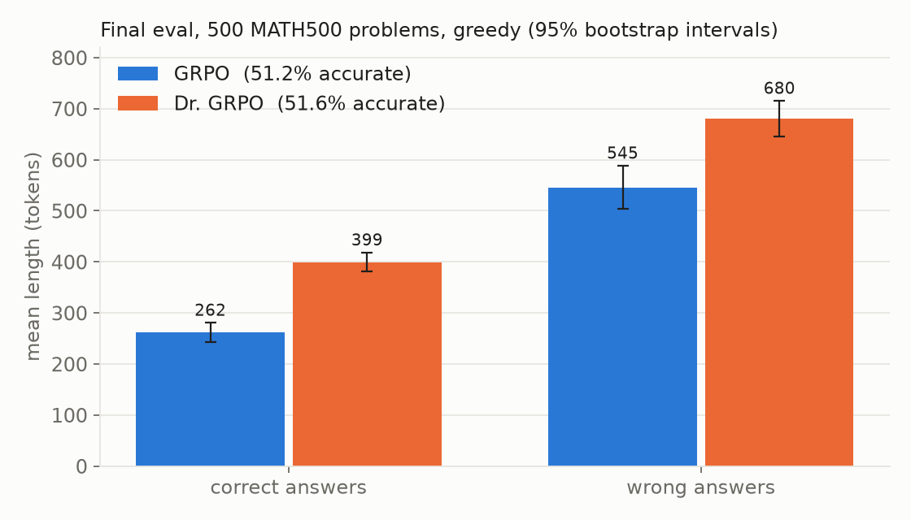

# Replicating Dr. GRPO: does GRPO's length normalisation inflate wrong answers?

A small scale replication of Liu et al. 2025,
[Understanding R1-Zero-Like Training: A Critical Perspective](https://arxiv.org/abs/2503.20783),
run as R1-Zero style reinforcement learning on Qwen2.5-1.5B with verifiable math
rewards.

**Result, one seed, at this scale:** the paper's accuracy claim holds and both of
its length claims come out reversed. Dr. GRPO matched GRPO's accuracy on
MATH500 (51.6% against 51.2%) but produced *longer* responses, including longer
wrong answers. The divergence only appeared in the second half of training, and
one seed cannot say whether it is robust. Read the result as "not reproduced
here", not as "refuted".

## The claim under test

GRPO, the objective behind DeepSeek-R1-Zero, averages each response's loss over
its own length (the `1/|o|` term) and scales each question's advantages by the
group's reward standard deviation. The paper argues both terms bias
optimisation: the length term penalises a long wrong answer less per token than a
short one, so wrong answers inflate. Dr. GRPO removes both terms. The paper
reports three things (Figure 5):

1. response length keeps growing under GRPO but not under Dr. GRPO,
2. Dr. GRPO's incorrect responses are substantially shorter on evaluation,
3. Dr. GRPO maintains reasoning performance.

## Results (seed 0)

Both arms trained on **the same 16 questions at every step** and were evaluated
on **the same 500 MATH500 problems**, so every comparison below is paired.
Brackets are 95% bootstrap intervals.

| Paper's claim | This replication | Verdict |
| --- | --- | --- |
| Length grows more under GRPO | Dr. GRPO was **99 tokens longer** per step on average [77, 123], and **239 longer** over the last third of training [217, 262]. Length trend: GRPO -0.2 tokens per step, Dr. GRPO +3.0. | reversed |
| Dr. GRPO's wrong answers are shorter | Longer: **680 against 545** tokens. On the 199 problems both arms got wrong, Dr. GRPO ran 120 tokens longer [80, 160]. | reversed |
| Dr. GRPO maintains performance | **51.6% against 51.2%**, paired difference +0.4 points [-3.4, +4.0] | holds |



For the first 50 steps the arms are indistinguishable. After that GRPO's
responses shorten and later partly recover, while Dr. GRPO's keep growing.





**One half of the mechanism does show up.** The paper's argument has two sides:
GRPO should make *correct* answers shorter and *wrong* answers longer. The first
side appears clearly (GRPO's correct answers are 262 tokens against 399). The
second does not.

**Truncation does not explain the gap.** 55 of 500 final responses hit the 1024
token cap in each arm, and during training the arms truncated a similar share
(8.2 and 9.2 of 128 responses per step).

## How this differs from the paper

Every deviation applies identically to both arms, and neither term under test
depends on any of them. They still bound how far the result generalises.

| | Paper | Here | Why |
| --- | --- | --- | --- |
| Training | full fine tuning | LoRA, rank 64 on all 7 projections | free GPUs have 15 GB |
| Learning rate | 1e-6 | 5e-5 | LoRA conventionally runs 10x to 100x higher |
| Generation budget | 3000 tokens | 1024 | memory and time |
| Steps | several hundred | 100 | time |
| Rollout | 8 sequential updates per 1024 responses | 1 on policy update per 128 responses | laptop scale batch |
| Hardware | 8x A100, bf16 | Kaggle 2x T4, fp16 | budget |
| Seeds | 3 | 1 | stopped at seed 0 by choice |

Model (Qwen2.5-1.5B base), prompt template, reward, training data and eval set
are the paper's own: the grader is the authors' code vendored unmodified
(`src/vendor/`), and the data are the authors' published arrow files.

## Limitations, stated plainly

- **One seed.** The bootstrap intervals capture variation across steps and
  problems, not across seeds, and two runs with identical settings drift apart
  after the first update (the bf16 and fp16 backward passes on GPUs are not bit
  reproducible). The paper used three seeds. This is the biggest gap.
- **Short and small.** 100 LoRA steps at a 1024 token budget. The paper's effect
  could need longer training, full fine tuning, or room to grow past 1024 tokens.
- **The mean hides structure.** Both arms reach the same accuracy by different
  routes; GRPO's length collapse between steps 55 and 80 is unexplained.

## Verification

The objective was tested before it was trusted:

- the per token gradient is exactly `-A/|o|` under GRPO and `-A/budget` under
  Dr. GRPO (`tests/test_objective.py`, `tests/test_objective_torch.py`);
- the PyTorch and MLX losses agree to 1e-6 on identical inputs;
- batched, padded log probabilities match an fp64 per sequence forward to 1e-5
  (`tests/test_train_torch.py`), which also caught that PyTorch's CPU
  `log_softmax` is itself off by 1.7e-4 over a 151,936 word vocabulary;
- merged weights reproduce the LoRA model's outputs (`tests/test_merge.py`);
- during training the sampler's and learner's log probabilities for the same
  tokens differed by only 0.002 to 0.004 nats, so the policy being sampled was
  the policy being trained.

## Engineering notes

The experiment started on an Apple M5 laptop in MLX and moved to Kaggle when
the laptop became unusable during runs. The Mac run (GRPO, 44 steps) is kept
under `runs/grpo_s0` as a pilot; it cannot be paired with a CUDA arm. Problems
found along the way, each with its commit:

- a Metal GPU timeout, caused by macOS paging out GPU buffers under memory
  pressure, fixed by wiring the working set;
- Qwen2.5-0.5B scored 0 of 128 under the strict answer format, so GRPO would
  get no gradient; hence 1.5B;
- vLLM on a T4 ran at 350 tokens/s; the cause was per request sampling seeds,
  not LoRA, and removing them tripled throughput;
- building all merged weights at once ran the sampler GPU out of memory; they
  now stream one tensor at a time;
- PyTorch reports bf16 as supported on a T4 by emulating it, so bf16 is keyed on
  compute capability instead.

## Running it

```bash
python3 -m venv .tvenv && .tvenv/bin/pip install torch transformers peft datasets vllm
.tvenv/bin/python src/fetch_data.py
.tvenv/bin/python src/train_torch.py --loss grpo   --seed 0 --steps 100
.tvenv/bin/python src/train_torch.py --loss drgrpo --seed 0 --steps 100
.tvenv/bin/python src/analyze.py 0 && .tvenv/bin/python src/plots.py
```

On Kaggle: `python kaggle/launch.py full --seeds 0` (uses your own Kaggle CLI
login). Seeds 1 and 2 are one argument away and cost about 4.4 GPU hours each.

## Layout

```
src/train_torch.py      PyTorch trainer: vLLM sampler, LoRA learner, checkpoints
src/train.py            the MLX trainer used for the laptop pilot
src/objective*.py       the loss (MLX and PyTorch twins)
src/variants.py         GRPO, Dr. GRPO and the two ablation arms; group advantage
src/analyze.py          paired per step and per problem comparison
src/plots.py            the figures above
kaggle/                 kernel entry point and launcher
runs/kaggle/            the seed 0 artifacts every number here comes from
```
